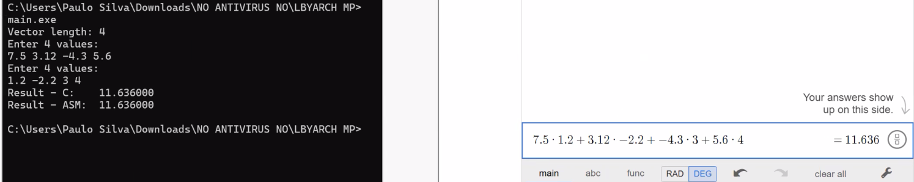
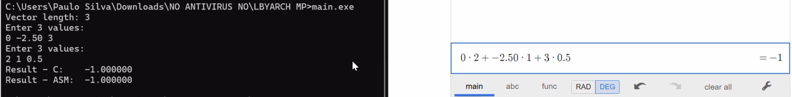
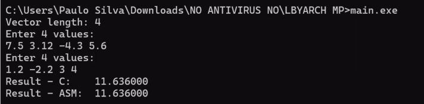
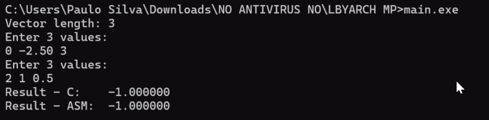

# LBYARCH - MCO2

**Developed by:**
- Cesar, Jusper Angelo M.
- Silva, Paulo Grane Gabriel

---

This project performs the dot product of two single-precision float vectors using:
- A C implementation
- An x86-64 SIMD implementation written in NASM

The program computes the dot product using both versions and prints the results for comparison.

---

## How to Run:

```bash
nasm -f win64 sdot_asm.asm
gcc -c -std=c99 main.c -o main.obj -m64
gcc main.obj sdot_asm.obj -o main.exe -m64
main.exe
```

## Test Cases with Correctness Check

### C

The output of the C implementation was cross checked using the Desmos calculator.




### Assembly

The output of the x86-64 SIMD assembly implementation was validated by comparing it directly with the result from the C function.




## Demo Video

